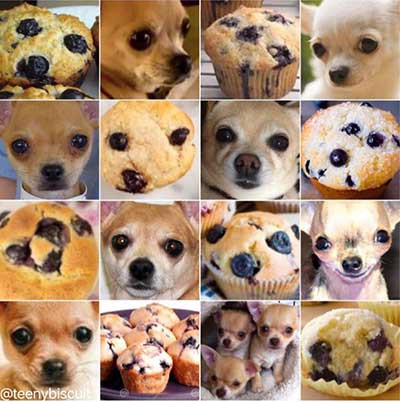

# Inleiding
---
AI is overal om ons heen. Denk maar aan gezichtsherkenning, weersvoorspelling, fraudedetectie, … We kunnen gewoon niet meer zonder. Het is zodanig ingeburgerd, dat we moeilijk nog het verschil tussen AI en mens kunnen onderscheiden. Denk maar aan ChatGPT, AI art, …

Wel, in deze workshop zullen we AI wat uit de doeken halen en onderzoeken hoe computers nu ‘leren’. Door middel van wiskundige modellen op basis van natuur en een beetje programmeerwerk zullen we een computer handgeschreven cijfers leren herkennen.
We zullen kennis maken met MNIST-database, neurale netwerken, “backpropagation of error”-algoritme, en nog zoveel meer!

## Wat is AI
AI kan gedefinieerd worden op verschillende manieren, maar algemeen gesproken is AI een algoritme die keuzes kan maken. Deze keuzes kunnen geprogrammeerd worden door de programmeur, denk maar aan AI in computerspellen, of deze keuzes kunnen aangeleerd worden.

Als we bijvoorbeeld een detectieprogramma willen schrijven om fruit te gaan sorteren, zullen we belachelijk veel voorwaarden moeten neerpennen om aan een computer te omschrijven wat het verschil is tussen een appel en een peer. Dit is praktisch niet haalbaar en dus zullen we een andere methodiek moeten gebruiken. Probeer maar eens een computer deze verschillen uit elkaar te laten halen:

Je voelt hem al aankomen: Self-Learning AI kan ons hier een beter antwoord gaan op geven.

### Self-Learning AI
Self-Learning AI is net zoals andere AI, geprogrammeerd. Maar, deze is geprogrammeerd op een zodanige manier dat ze uit een gigantische hoop data traint, en nog nooit eerder geziene data kan classificeren. Ze leert dus zelf zonder dat wij alle regels en onderscheidingen moeten programmeren wat die onderscheidingen zijn. 

De data waarmee de AI traint is vaak gelabeld. En jammer genoeg wordt dit handmatig gedaan door crowd-sourcing of door wetenschappers.
Gelukkig is er doorheen de jaren al veel gelabelde data, waaronder de MNIST-database.

### MNIST
MNIST-database bevat honderden duizenden voor-gelabelde data voor handgeschreven cijfers. Deze is publiek domein en is dus gratis ter beschikking voor iedereen! Wat een geluk! We kunnen dus deze database gaan gebruiken om modellen te trainen die cijfers moeten herkennen! Er bestaan nog een heel pak andere gigantische datasets!

### Crowd Sourcing
Indien je zelf data hebt dat volledig custom is, dan kan het handmatig labelen van data zeer veel werk vragen. Er zijn hiervoor verschillende oplossingen. Je kan bijvoorbeeld een neuraal netwerk schrijven die zonder labels werkt (maar dit is erg moeilijk en vergt veel energie en rekenkracht) ofwel kan je ze laten crowdsourcen. Je zend dus eigenlijk al je data naar een bedrijf, en zij zullen deze handmatig labelen voor jou.
:::info
Deze methode is uiteraard kostelijker naarmate je meer en meer data hebt, en is ethisch ook echt een groot vraagteken! De bedrijven huren vaak mensen van buitenlandse afkomst tegen belachelijk lage prijzen!
Tegenwoordig zijn er technologieën zoals Google Recapcha. Dit is eigenlijk zeer gelijksoortig!
:::

## Neurale Netwerken
---
Een neuraal netwerk is precies dat: een netwerk met neuronen. Als we kijken naar de biologie is dit exact hetzelfde als hersenen. We zullen dus weer inspiratie opdoen van de jaren biologische evolutie om onze systemen te verbeteren.

### Neuronen
Een neuron doet in de biologie maar 1 ding: elektrische stroom doorlaten of verhinderen. Deze is analoog en kan dus een bereik hebben in amplitude. Een neuron is eigenlijk niet meer dan een functie: input -> output. 

Maar niet elke neuron vuurt even gemakkelijk. Stel je voor dat je heel veel tolerantie hebt voor pijn, dan zal de input (pijnprikkel) veel sterker moeten zijn vooraleer de output (sensatie van pijn) sterk genoeg is om effect te hebben op het resulterende gedrag. Dit noemen we de bias. Het is een drempelwaarde die ervoor zorgt dat de neuron een minimale stimulatie nodig heeft om te triggeren. Zo kan ons lichaam ook onderscheid gaan makken tussen masseren en slaan. 

De output van die neuron wordt vaak doorgegeven aan een andere neuron, waarbij de verbinding tussen beide neuronen sterk of zwak kan zijn. Denk aan eten: we hoeven er niet bij stil te staan hoe we onze tong moeten bewegen, hoe we moeten knabbelen en slikken. De neuronen die hiervoor zorgen hebben algemeen gesproken een goede connectie. Maar als je voor het eerst een kwadratische vergelijking oplost, dan kost het wat tijd en moeite en moet je hier al wat langer over nadenken. We zeggen dus dat deze neuronen een minder sterke verbinding hebben.

Die sterkte in verbinding noemen we het gewicht (of weight in het Engels).
En dan hebben we nog 1 buzzword: activatie.
De activatie van een neuron is volkomen biologisch bepaalt en scheelt van persoon tot persoon. Dit bepaalt de mate waarin een neuron moet triggeren wanneer het de bias overschrijdt. Als de input hoog is, maar de output niet, dan kan dat perfect zijn dat de neuron ervoor zorgt dat deze prikkel gedempt moet worden.
!!Verwar dit zeker niet met bias! Bias zorgt ervoor dat er een minimum waarde nodig is vóór een neuron triggert, en de activatie zorgt ervoor hoe sterk ze triggert, gegeven een input!

:::caution
Dus we hebben 3 componenten: bias, gewicht en activatie. Deze 3 termen komen vaak aan bod, dus zorg zeker goed dat je ze begrijpt!
:::
:::info
Merk op dat niet alle neuronen hoeven verbonden te zijn met elkaar in de biologie! Dit hoeft ook niet echt binnen AI, maar wordt vaak wel gedaan om het wiskundig eenvoudiger te houden. Er zijn neurale netwerken die hun topologie kunnen veranderen, maar die werken over het algemeen op een ander leerprincipe! Ik denk hier bijvoorbeeld aan [NEAT]( https://en.wikipedia.org/wiki/Neuroevolution_of_augmenting_topologies).
:::

### Netwerken
Vele neuronen die verbonden zijn met elkaar noemen we een netwerk. Over het algemeen zijn alle neuronen per laag verbonden met alle neuronen op de volgende laag. Dit is een vaak voorkomend netwerk en kan al heel veel complexe zaken gaan oplossen!
Maar, niet alle netwerken zijn dezelfde! We hebben een compleet ander netwerk nodig voor bijvoorbeeld tekstvoorspelling/generator dan voor een beeldverwerker!
Hieronder een paar voorbeelden van soorten netwerken:
-	NEAT (Constante taken)
-	Convolutional Network (Afbeeldingen en Video)
-	Perceptron (Een zeer simpel netwerk)
-	LSTM (Long Short-Term Memory) (Tekst)
-	Recurrent Neural Network (Voornamelijk voor het weer)
-	…

## Python
We zullen in deze workshop voornamelijk gaan werken met Python.
Python is een (scripting)taal die vaak gebruikt wordt binnen AI. Het is snel om te schrijven en heeft goede visualisaties.

Als je geen idee hebt wat Python is, je hebt er nooit in gewerkt of je hebt nog nooit geprogrammeerd, dan kan je altijd gebruik maken van de online [documentatie!]( https://docs.python.org/3/library/index.html)

:::tip
Als je zou vast lopen, dan is het de bedoeling dat je online hulp gaat raadplegen! Zo doet een goede programmeur dit ook! Er zijn goede bronnen zoals Stackoverflow online gratis ter beschikking!
:::
:::info 
Python zelf wordt vaak gebruikt voor datavisualisatie en na dat een netwerk volledig getraind is, maar het trainen zelf en het verwerken van grote datasets wordt binnen de industrie voornamelijk gebruikgemaakt van C en C++.
:::

## Let’s Go
---
Vooraleer we van start gaan in het dus zeer belangrijk dat je een beetje begrijpt wat een neuraal netwerk is!
We gaan een neuraal netwerk leren om de XOR-operatie uit te voeren! Dit maakt alles super eenvoudig, maar weet dat neurale netwerken hier niet tot beperkt zijn!

