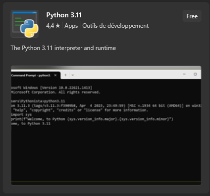
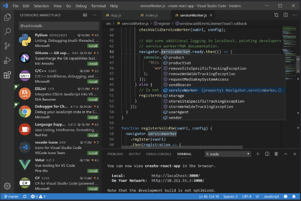
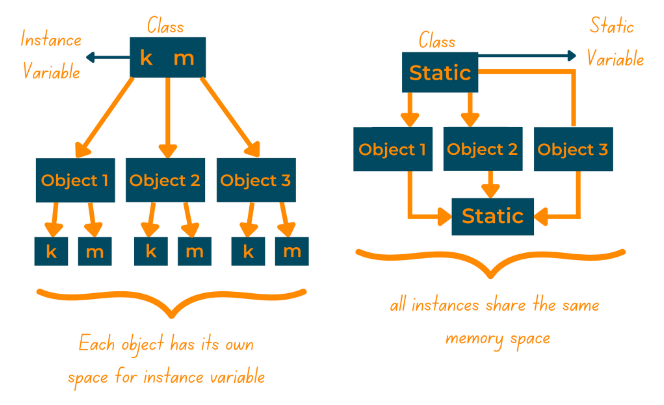

# Python
Doorheen de workshop gaan we Python gaan gebruiken. Ze is gemakkelijk te begrijpen,
kan snel resultaten tonen en heeft enorm veel handige bibliotheken!

In dit deel gaan we de basis van Python uitleggen. Net genoeg zodat je kan volgen! Als je Python al kent, dan mag je gerust dit deel overslaan!

:::tip
Je mag altijd de documentatie gaan raadplegen en vragen die je hebt, opzoeken.
De officiële documentatie vind je [hier](https://docs.python.org/3/library/index.html). [Stackoverflow](https://stackoverflow.com) is ook een godsent!
:::

## Python schrijven
---

Windows heeft in de Windows-Store een Python-Shell ter beschikking voor je! We gaan hier niet mee werken, maar het kan handig zijn om snel dingen te testen, en snel iets te laten uitvoeren zonder een volledige IDE te moeten gebruiken.
Je kan ook gebruik maken van de gratis editor: [VSCode](https://code.visualstudio.com).




:::info
Je kan ook zeker IDE's gaan gebruiken om Python code te schrijven en te runnen! 
We raden aan om PyCharm te gebruiken!

Om die te installeren op Linux gebruik je dit commando (pas aan waar nodig):
```
sudo snap install [pycharm-professional|pycharm-community] --classic
```
:::

## Variabelen
---

Python is een _typeless_ programeertaal. Dit wil zeggen dat een variabele van type
kan veranderen zonder problemen.

We declareren een variabele aan de hand van het `=` teken.
Voer eens onderstaande code uit.
```py
a = 5
print(a)

a = 'Hello'
print(a)
```
Merk op dat het type variabele verandert! Eerst is het een getal en daarna een string! Python zal weten wat te doen en automatisch het type gaan veranderen!

:::danger
Omdat deze types silent veranderen op de achtergrond, kan dit typeErrors gaan geven, bewerkingen kunnen onvoorspelbaar gedrag vertonen, ...
:::

In dit deeltje zullen we de voornaamste en meest voorkomende variabelen bespreken in het kort. Raadpleeg online bronnen voor meer info.

### Integers en floats

Integers zijn gehele getallen. Integers hebben een 32-bit binaire representatie met 31 bits aan data. De 32ste bit bepaalt indien het een negatief of positief getal is.

Floats zijn komma getallen, ook met een 32-bit binaire representatie.

Er zijn nog heel veel andere soorten variabelen om getallen te gaan voorstellen, maar omdat Python zelf gaat bepalen wat deze moeten zijn goeven we hier dus geen rekening mee te houden!

```py
integer = 25
float = 16.25

print(integer + float)
```
Als je bovenstaande code uitvoert, zal je zien dat Python automatisch weet wat er moet gebeuren! Het resultaat is van het type `float`.

### Booleans

Een boolean is maar 1 bit groot. Ze kan ofwel `0` ofwel `1` zijn. Dit wordt vaak verwoord als `False` en `True` respectivelijk.

```py
ikBenBoolean = True

ikBenInteger = False
```

### Strings

Een string is een stukje tekst. Ze kan worden gemanipueerd en wordt zeer vaak gebruikt.
```py
tekst = "Ik ben een String en sta tussen aanhalingstekens!"
```

Er zijn ingebouwde functies op strings. Deze kan je altijd in de documentatie terug vinden!

### Arrays en lijsten

Arrays en lijsten zijn eigenlijk meerdere elementen van een zelfde datatype! Zo kan je meerdere getallen gaan opslaan, deze gaan wijzigen en bewerkingen op uitvoeren!

Arrays bestaan niet binnen Python, maar lijsten wel. Arrays kan je alsnog gaan gebruiken met de bibliotheek NumPy! (Later hier meer over!)

Arrays en lijsten zijn eigenlijk hetzelfde met het verschil dat lijsten groter en kleiner kunnen worden en dat bij Arrays niet kan!

Een lijst kan je als volgt gaan definiëren:
```py
mijnlijst = [1,2,3,4]

print(mijnlijst[0])
```
Om een element te gaan aanspreken uit de lijst beginnen we met tellen vanaf 0! Dus het item op plaats 1, is eigelijk 0 in code!

### Scoop

Een variabele wordt altijd gedefinieerd binnen een bepaalde scoop. Deze scoop zorgt ervoor dat we niet elke variabele een unieke naam moeten geven en helpt ons gemakkelijker geheugen vrij te houden!

Een scoop kan je vergelijken met het nummeren van een klasnummer. Iedereen heeft per klas een uniek nummer, maar als je een uniek nummer buiten deze klas wilt hebben zal je vaak in conflict geraken met een andere klas! Om ervoor te zorgen dat deze gescheiden blijven, hebben we ze een andere scoop gegeven. Je klasnummer is enkel geldig binnen je klasgroep, en daarbuiten mag je enkel je studentennummer gaan gebruiken.

Deze scoops worden bepaald door **indenetatie** binnen Python. Dit komt voor bij lussen, functies, klassen, if-statements, ...

```py
studentennummer = 42069
klas = 2

if klas == 2:
    #Dit is indentatie!
    mijnnummer = 16
    print(mijnnummer)

print(mijnnummer)

```

Als je dit gaat uitvoeren, zal je een referentie error krijgen omdat `mijnnummer` niet bestaat bij de laatste print. `mijnnummer` was enkel beschikbaar binnen de scoop van de if-statement. Eenmaal we hierbuiten gingen, werd deze variabele vernietigt.

:::note
We kunnen het keyword _global_ gaan gebruiken om dit te voorkomen, maar 95% van de tijd zal dit niet nodig zijn!
:::

## Commentaar
---

In Python kunnen we ook gebruik gaan maken van commentaar. Dit zijn lijntjes binnen uw script of programma die worden genegeerd door de compiler!

Zo kan je gemakkelijker je code gaan documenteren!

```py
# Dit stukje zorgt voor een simpele faculteitsberekening van 5!
result = 1
for i in range(1,5,1):
    result *= i

# Dit stukje print het resultaat naar de console!
print(result)

"""
Dit is commentaar dat 
op 
meerdere lijnen kan!
zonder telkens een nieuwe # te plaatsen!
"""

#NOG MEER COMMENTAAR???!!!
```

:::caution
Te veel commentaar is ook niet goed! Zorg ervoor dat de commentaar betekenisvol is! Code die duidelijk leesbaar is, heeft geen commentaar nodig!
:::

## Bibliotheken
---

Binnen Python zijn er heel wat bibiotheken geschreven! Zij bieden fucties al op voorhand aan, zodat je ze zelf niet meer hoeft te schrijven en te optimaliseren!

Zo moet je ook het wiel niet opnieuw uitvinden! De functie `print()` is al geschreven door iemand! Zo moeten we zelf niet meer gaan programmeren wat er allemaal moet gebeuren om tekst te printen naar de console!

:::caution
Je kan variabelen definiëren die per ongelijk dezelfde naam hebben als functies binnen bibliotheken. Pas hier voor op, want je overschrijft die dan!
:::

:::note
Extra bibliotheken zijn trouwens ook altijd installeerbaar!
:::

### Import
Binnen Python kunnen we bibliotheken binnenhalen met het keyword `import`.
```py
import math  #We importeren

math.sqrt(5) #We spreken de bib aan, en gebruiken hun sqrt()-functie
```

We kunnen ook gaan importeren en de bibliotheek een andere naam geven om te gebruiken binnen onze code. Dit kan handig zijn om het overschrijven met variabelen te voorkomen, of om de code in te korten! We gebruiken hiervoor `as`.
```py
import math as wiskunde

wiskunde.sqrt(5)
```

Het kan ook zijn dat we enkel maar 1 bepaalde functie of klasse willen importeren. Hiervoor gebruiken we `from`

```py
from math import sqrt as wortel

wortel(5) #we kunnen het nu gaan gebruiken zonder eerst de bib te moeten aanspreken
```

We zullen voornamelijk de Numpy bibliotheek gaan gebruiken. Je kan alle functies hiervan online in de [documentatie](https://numpy.org/doc/stable/user/basics.html) terug vinden!

```py
import numpy as np

np.array([1,2,3,4]) # Hier gebruiken we array functionaliteit
```
:::info
Numpy is geschreven in C. Python is eigelijk een geïnterpreteerde taal dat geschreven is op de C-kern. Hierdoor is Python traag, maar kunnen bibliotheken zoal Numpy, Pandas, ... die geschreven zijn in C, Python gaan versnellen!
:::

:::note
Normaal gezien staan de bibliotheken die je nodig hebt in deze workshop al standaart op je PC. Die zouden mee geïnstalleerd zijn tijdens het installeren van Python zelf. Als dit niet het geval zou zijn omdat Python de bibliotheken niet ken, kan je ze gerust gaan installeren met de Pyhton Pakage Manager (pip).

Zorg er eerst voor dat je pip hebt:
`sudo [dnf][apt] install pip3`

Afhankelijk van je OS zal je dnf of apt moeten gebruiken.

Installeer vervolgens de packages:
`pip3 install [package]`

Je kan _[package]_ vervangen door de nodige bibliotheek.

De bibliotheken dat je nodig zult hebben zijn:
- NumPy
- MatplotLib
- Scipy
:::

## Condities en Lussen
---

Code die altijd uitgevoerd wordt ongeacht van bepaalde omstandigheden, is vaak _(nooit)_ aangeraden! Je zal al heel vroeg merken dat je bepaalde zaken wilt gaan uitvoeren onder bepaalde voorwaarden! Zo kan je bepaalde instructies laten uitvoeren alleen als dit nodig is!

Je kan dit nog een stapje verder laten gaan en code laten herhalen tot er een bepaalde voorwaarde is voldaan of zich voortoont!

In dit stukje kijken we snel even wat een if-statement is en wat we kunnen doen met lussen!

### if-statements
Een if-statement zal afhankelijk van een de conditie code uitvoeren!

Deze condities worden uitgedrukt in `True` en `False`; **booleans** dus!
Bekijk volgende voorbeeldcode:
```py
leeftijd = 15

if leeftijd < 18: #conditionele check gebeurt hier!
    print("Je bent nog niet volwassen!")

print("Done!")
```
De code zal enkel printen indien je niet volwassen bent zolang je jonger bent dan 18 jaar! We zien hier een `<` gebruikt worden. Dit noemen we de _conditional operator_!

We hebben heel wat opties:
- < Kleiner dan
- \> Groter dan
- == Gelijk aan
- <= Kleiner dan of gelijk aan
- \>= Groter dan of gelijk aan

We hebben ook _boolean operators_:
- and De "en"-operatie
- or De "of"-operatie
- ! De "niet"-operatie
- not() De"niet"-operatie, maar als funtie.

De if-statement heeft ook een _else_:
```py
leeftijd = 15

if leeftijd < 18: #conditionele check gebeurt hier!
    print("Je bent nog niet volwassen!")
else:
    print("Proficiat, je bent al volwassen!")

print("Done!")
```
De else-code wordt enkel uitgevoerd als de conditie als **False** werd geëvalueerd!

Je kan dit zo groot en complex maken als je maar wilt:

```py
# Importeer onze bibliotheken
from random import randint as r

# definieer een rechthoek met 2 punten
x1 = 10; y1 = 10
x2 = 20; y2 = 20

#neem een willekeurig punt tussen 0 en 30 voor de (x,y) coordinaten
px = r(0,30); py = r(0,30)
print("Het punt is: ({},{})".format(px,py))

#controleer waar het punt zich bevind
if (px >= x1 and px <= x2) and (py >= y1 and py <= y2):
    print("Het punt ligt op de rechthoek!")
else:
    if px < x1: #links
        if py < y1: #onder
            print("Het punt ligt links-onder van de rechthoek!")
        else if py >= y1 and py <= y2: # Midden
            print("Het punt ligt links van de rechthoek!")
        else: # Boven
            print("Het punt ligt links-boven de rechthoek!")
    else: #rechts
        if py < y1: #onder
                print("Het punt ligt recht-onder van de rechthoek!")
        else if py >= y1 and py <= y2: # We kunnen ook een else-if gebruiken!
            print("Het punt ligt recht van de rechthoek!")
        else: # boven
            print("Het punt ligt rechts-boven de rechthoek!")

print("Done!")
```

:::tip
Zoals je kan zien kan dit snel uit de hand lopen als we if-statements gaan nesten! Probeer dit dus zoveel mogelijk in te perken! Een basiskennis van booleaanse algebra kan hier veel bij gaan helpen! Maar, vergeet zeker niet dat dit komt met ervaring!
:::

### Lussen

Soms kan het zijn dat je meerdere code wilt herhalen! Denk maar aan een lange sommatie, of het doornemen van elke leerling op een lijst! Hiervoor zijn lussen een ideale oplossing!

#### While-lus

De while lus is de makkelijkste! Zij zal de code binnen de lus altijd uitvoeren, **zolang** er een bepaalde voorwaade **True** is!

```py
leeftijd = 15

while leeftijd < 18:
    print("Ik ben nog te jong!")
    print("Een jaar later...")

    leeftijd += 1

print("Ik ben oud genoeg! Laat me hier uit!")
```

We kunnen ook prematuur uit onze loop gaan breken met het keyword _break_. Dit zorgt ervoor dat we uit de **huidige** lus breken waarin de keyword wordt opgeroepen!

```py
leeftijd = 15

while leeftijd < 18:
    print("Ik ben nog te jong!")
    print("Een jaar later...")

    if leeftijd == 17:
        print("Ik ben nu 17, ik wil niet meer ouder worden!")
        break

print("Ik ben oud genoeg! Laat me hier uit!")
```

:::tip
Deze techniek wordt vaak gebruikt in een game-loop. Een gameloop loopt zoalang de speler zin heeft! Er is dus niet echt een conditie om uit deze loop te geraken. Dus doen ze vaak het volgende:
```py
#Deze code zal niet compileren of uitvoerbaar zijn!

leeftijd = 15

while True: # Hierdoor blijft de loop zich voor altijd herhalen!
    
    inp = getInput()
    updatePosition()
    updateFrame()
    printFrame()

    if inp == "EXIT":
        break #Hiermee kunnen we buiten de lus!

saveGame()
memoryCleanup()

print("Done!")
```
:::
:::danger
While-loops (en lussen in het algemeen), kunnen oneindig doorgaan, ook al is dit niet gewenst! Als dit zich voordoet, kan de rest van de code nooit gerunt worden!
:::

#### For-loop
De for-loop is een lus die veel in de achtergrond gaat doen. We gebruiken die vaak om door lijsten te itereren!

Stel we hebben volgende lijst:
```py
leerlingen = ["Jens","Amparo","Michael","Kenzo"]
```
Als we nu voor elke leerling hun naam willen opvragen, dan willen we dit aanpakken op volgende manier:
```py
leerlingen = ["Jens","Amparo","Michael","Kenzo"]

for leerling in leerlingen:
    print(leerling)
```
Merk op dat we voor elke `leerling` in `leerlingen` doorlopen. We nemen het eerst volgend object uit de lijst en kennen de waarde van dat object toe aan de variabele `leerling`! Deze kunnen we nu gaan gebruiken hoe we maar willen!

Stel dat we hier nu een ID voor willen plaatsen. Het ID is dan gelijk met de positie waarin de leerling zich bevind.

```py
leerlingen = ["Jens","Amparo","Michael","Kenzo"]

for i, leerling in enumerate(leerlingen):
    print("ID: ", i + 1, " - ", leerling)
```

WOW! Wat is er hier allemaal gebeurd???!!! Wel, de _enumerate_ gaat eigelijk een tuple gaan maken van elke lijstitem in die lijst met daarin het positienummer. We kunnen dat positienummer gaan refereren en we slaan dit op in de variabele `i`! Tergelijk gaan we de naam gaan opslaan in leerling!

Herinner je, dat alles start met tellen van 0, en om dus geen 0 te hebben als ID, moet je er 1 bij optellen!
:::note
Als je meer wilt weten over tuples in Python, kan je dit altijd gaan opzoeken!
:::

:::tip
Vaak gebeurt het dat je enkel een for-loop moet toepassen op een bepaald bereik. Je kan hiervoor **range()** gaan gebruiken!
:::

:::warning
Het is van groot belang dat je met enumerate de i (index) **vooraan** plaats!
:::

:::tip
Gebruik vaak i, j en k. Dit zijn vaak gebruikte variabelen binnen in de programmerwereld! Maak er een gewoonte van deze te gaan gebruiken!
:::

## Functies
Functies zijn eigelijk aanroepbare stukjes code. Ze kunnen ervoor zorgen dat we minder code moeten herschrijven, en kunnen ons abstractie geven. Als we heel goede functies kunnen schrijven en benoemen, kan je van een programmeertaal bijna een spreektaal maken!

Zoals in de wiskunde hebben functies parameters en een resultaat. Deze kunnen we dan verder gaan gebruiken in onze code.

Een functie definieer je als volgt:
```py
def functienaam(parameter1, parameter2):
    return parameter1 + parameter2

def functie2(parameter1=1):
    #doe iets...
    return
```
Bij de eerste functie hebben we 2 parameters gedefinieerd. Deze zijn verplicht om mee te geven! 

Bij de 2de functie hebben we maar 1 parameter gedefinieerd. Deze is niet verplicht om mee te geven. Als we geen parameter meegeven, dan is de standaardwaarde gelijk aan 1 (bij deze functie).

Het `return` keywoord zorgt ervoor dat we terug keren vanwaar de functie opgeroepen is. Als we de return waarde leeg laten, dan returnen we niets. Dit is hetzelfde als `NULL`. De "null-waarde' betekend niets.
Als de return waarde niet leeg is, dan wordt het resultaat terug gestuurd naar de variabele.

We kunnen functies gaan oproepen door zijn functienaam op te roepen, met daartussen al dan niet de parameters.

```py
#berekent de faculteit van n
def faculteit(n):
    result = 1
    for i in range(1, n):
        result *= i
    
    return result

fac = faculteit(2)
print(fac)
```
Merk op dat het resultaat van de functie wordt opgeslaan in fac! Als de return waarde leeg zou zijn, dan is die gelijk aan `Null`.

:::note
Functies kunnen nog veel meer dan hierboven beschreven zoals recursie, overloading, decorating, ...
Je zou met deze info aan de slag kunnen gaan, maar als je geïnteresseerd bent, kan je altijd opzoeken!
:::

:::tip
Stel dat je een functie 2 namen wilt geven, maar ze moeten exact het zelfde doen, kan je het volgende toepassen:
```py
def som(x, y):
    return x + y

optelling = som #merk op: zonder '()'

print(som(2,3))
print(optelling(2,3))
```
Ze roepen onderliggend dezelfde functie op!
:::

:::danger
Als je dus variablen gaat gebruiken die dezelfde naam hebben als de functie, kan het zijn dat je de functie overschrijft, hem later nog nodig hebt, en een Error krijgt!
Dit is het grootste nadelen aan schrijven in een _typeless_ programmeertaal!
:::

## Klassen
Een klasse kan men eigenlijk zien als een verzameling van variabelen en functies. Deze variabelen omschrijven de staat van een klasse, en de functies omschrijven de functionaliteit.

En klasse kunnen we eigelijk aanzien als een voorwerp van een bepaalde soort. Denk bijvoorbeeld aan een balpen. Ze heeft een bepaalde lengte, een bepaald ontwerp, een kleur, kan schrijven, ... Al deze eigenschappen kunnen we in een klasse steken.

In onze code kunnen we dan simpelweg de klasse opvragen en een bepaalde functionaliteit laten uivoeren dat we willen!

:::note
Klassen zijn zeer complex en kunnen heel veel doen, we leggen hier enkel de basis uit, maar weet dat er nog veel meer bij te leren valt!
:::

### Definiëren van een klasse
Een klasse gaan we gaan definiëren op de volgende manier:
```py
import math as m

class Punt:
    #statische variabelen
    x = 5
    y = 4

    #functies
    def afstand_euler():
        return m.sqrt(x*x + y*y)

    def afstand_manhatten():
        return x + y

p1 = Punt()
print(p1.x)
print(p1.afstand_euler())
```
:::info
Deze statische variabelen en functies zijn publiek! Dit betekent dat ze toegankelijk zijn indien de klasse is aangemaakt. We maken een klasse aan op de zelfde manier als we een functie oproepen! We kunnen dan attributen gaan opvragen uit die klasse met `.`
:::

Statische variabele zijn toehankelijk voor elke instantie van die klasse en hiermee hoef je geen nieuwe instantie te maken om die te refereren!

```py
def Leerling:
    aantal = 0

    def __init__(self, naam):
        aantal += 1
        print("leerling gmaakt")

        self.naam = naam
```

Hier wordt telkens het aantal leerlingen verhoogt indien er een nieuwe leerling wordt aangemaakt. Maak je nog niet druk over de init en self, dit wordt straks uitgelegd.

Deze variabele kunnen we dan opvragen als:
```py
Leerling.aantal
```

We kunnen dit gaan zien als een overkoepelende variabele die gemeenschappelijk geheugen heeft voor alle instanties van die klassen. 

Het `self` keyword verwijst naar een lokale variabele en wordt bij elke instance opnieuw aangemaakt. Als je hierin een wijziging brengt in 1 instantie, zal de andere instantie niet wijzigen.

Volgend figuurtje zou dit wat duidelijk moeten maken:


### Speciale functies in klassen
Binnen in klassen zijn er voorgedefiniëerde functies. Deze worden aangesproken automatisch wanneer er een bewerking gebeurt met een klasse. We zullen hier de meest voornamelijke overlopen.

:::tip
Je kan deze functies herkennen omdat de naam omringt is met 2 underscores! \_\_init()\_\_, we noemen die _dunder methods_
:::

#### \_\_init\_\_()
De init() is de constructor. Deze functie wordt **ALTIJD** opgeroepen wanneer er een nieuwe instantie van de klasse wordt gemaakt. Je kan hier ook parameters meegeven die de begintoestand van de instantie omschrijven.

```py
class Balpen:

    def __init__(self, grootte, kleur, merk):
        """
        Merk op dat de self verwijst naar een volledig nieuwe variabele,
        maar dan lokaal! We kunnen dus zogezegt 2 variabelen dezelfde naam geven!

        Om onderscheid te maken wanneer het de lokaal - of functievariabele is, gebruiken we self!
        """
        self.lengte = grootte
        self.kleur = kleur
        self.brand = merk

pen1 = Balpen(20, "groen", "bic")
pen2 = Balpen(15, "blauw", "casio")

print(pen1.brand)
print(pen2.kleur)
```

:::note
Merk op dat deze lokale (self) variabelen dezelfde naam kunnen hebben, maar verschillend geheugen!
:::

#### \_\_eq\_\_()
Deze wordt opgeroepen wanneer de bewerking `==` zich voordoet! Je kan dus zelf gaan bepalen wanneer 2 instanties voldoen om gelijk te zijn!

```py
class Balpen:

    def __init__(self, grootte, kleur, merk):
        self.lengte = grootte
        self.kleur = kleur
        self.brand = merk
    
    def __eq__(self, other):
        return (self.lengte == other.lengte) and
                (self.kleur == other.kleur) and
                (self.brand == other.brand)

pen1 = Balpen(20, "groen", "bic")
pen2 = Balpen(15, "blauw", "casio")
pen3 = Balpen(20, "groen", "casio")

print(pen1 == pen3) #False
pen3.brand = "bic"  #Bekijk tip
print(pen1 == pen3) #True
```

:::tip
Het is geen goede gewoonte om variabelen zomaar aan te passen! Je kan per ongelijk het type veranderen en integriteit van je code verprutsen!
Gebruik dus zoveel mogelijk getters en setters! Dit valt buiten de scoop van deze workshop, maar je mag er altijd over opzoeken!
:::

#### andere
Zo zijn er nog een heel aantal aan ingebouwde functies!
Een volledige lijst kan je hier terugvinden: [lijst](https://mathspp.com/blog/pydonts/dunder-methods#list-of-dunder-methods-and-their-interactions)

### Overerving
Binnen in klassen kunnen we gaan overerven van andere klassen! Dit betekent dat we hun functies en variabelen gaan opnemen! Ze worden ook volledig aanspreekbaar en manipuleerbaar!

Stel je volgende situatie voor: Je wilt een leerling en een leerkracht object gaan maken in je code. Je kan hier 2 apparte klassen voor aanmaken op deze manier:

```py
class Leerling:
    #statische vars
    aantal = 0

    #dunders
    def __init__(self, naam, leeftijd, klas)
        self.naam = naam
        self.leeftijd = leeftijd
        self.klas = klas

        # voeg 1 toe aan totaal
        aantal += 1

    #functies
    def vertel_naam(self):
        print(self.naam)

class Leerkracht:
    #statische vars
    aantal = 0

    #dunders
    def __init__(self, naam, leeftijd, vak)
        self.naam = naam
        self.leeftijd = leeftijd
        self.vak = vak

        # voeg 1 toe aan totaal
        aantal += 1

    #functies
    def vertel_naam(self):
        print(self.naam)
```

Merk op dat we zo goed als 2 keer exact dezelfde klas hebben gemaakt, met het verschil dat de leerling in een bepaalde klas zit en de leerkracht een bepaald vak geeft. Merk ook op dat ze beide dezelfde functionaliteit hebben nl. `vertel_naam`.

Als we heel veel verschillende klassen hebben en een bepaalde functionaliteit willen veranderen, dan moeten we dit doen over alle gedefiniëerde klassen! Dit is super onhandig en tijdsrovend!

We kunnen dus 1 abstracte klasse maken (abstract wilt gewoon zeggen dat je die niet kan instantiëren) persoon, en daaruit leerling en leerkracht laten erven!

:::info
In Python bestaan abstracte klassen niet! Deze functionaliteit wordt aangeboden in het pakket `abc`. Je moet hier dan gebruik maken van decorators!
```py
from abc import ABC, abstractmethod
 
class Polygon(ABC):
 
    @abstractmethod
    def noofsides(self):
        pass
```
:::

We kunnen dus nu onze overerving klaarzetten:

```py
# ----------- Hier gaan we de persoon omschrijven ------------
class Persoon:

    def __init__(self, naam, leeftijd):
        self.naam = naam
        self.leeftijd = leeftijd
    
    def vertel_naam():
        print("Ik ben ", naam)


# ----------- Hier gaan we de overervende omschrijven ---------
class Leerling(Persoon): #Hier erft leerling alles over van Persoon
    # Hier voegen we de extra fucntionaliteit aan toe
    def __init__(self, naam, leeftijd, klas):
        super().__init__(self, naam, leeftijd)

        self.klas = klas

class Leerkracht(Persoon):
    def __init__(self, naam, leeftijd, vak):
        super().__init__(self, naam, leeftijd)

        self.vak = vak

leerling1 = Leerling("Jens", 22, "IT")
leerkracht1 = Leerkracht("Sven", 35, "IaC")

leerling1.vertel_naam()
leerkracht1.vertel_naam()
```

Het `super` keyword slaat op de parent. In dit geval is de parent van Leerling de Persoon klas! Super gaat dus de **éérst**bovenliggende klasse gaan aanspreken! Je kan op die manier ook variabelen gaan opvragen!

Zoals je kan zien kunnen klassen heel complex worden! En dan nog maar zwijgen van overloading en multi-inheretance, ...! Gelukkig zal je die voorkennis niet nodig hebben om onze workshop te maken! Als je deze concepten, al is het maar vaag, onder de knie hebt, dan zal de workshop moeten lukken!

## Einde
Python is dus zeer gemakkelijk te leren! Als je nog vragen zou hebben of je wilt wat dieper gaan springen in Python dan raad ik zeker online documentatie aan!

Kort samengevat hebben we geleerd wat variabelen zijn, wat bibliotheken zijn wat functies zijn en wat ze kunnen doen en wat klassen zijn!

Laten we dan nu beginnen aan onze workshop!